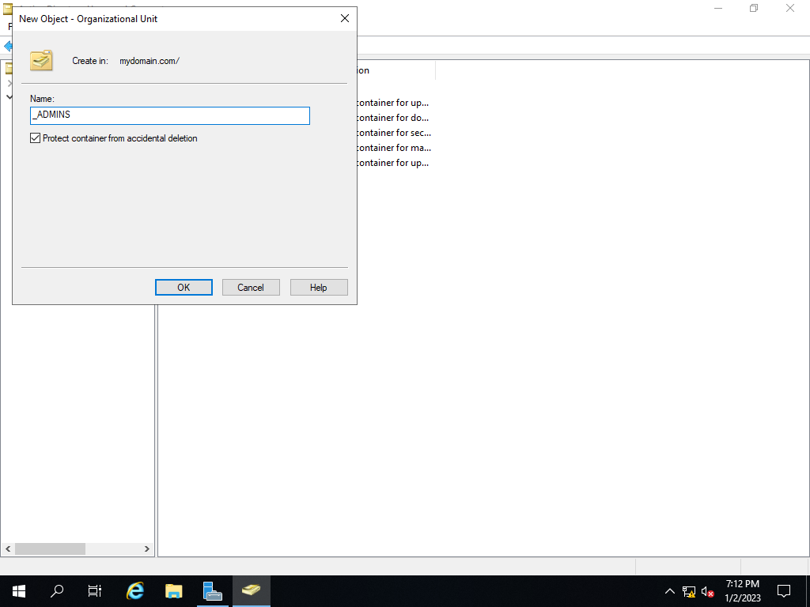
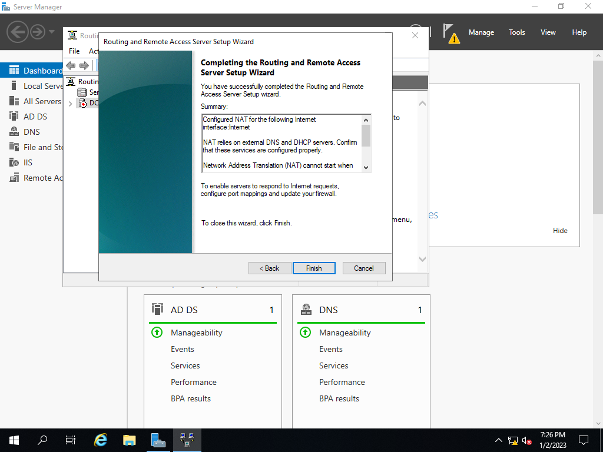
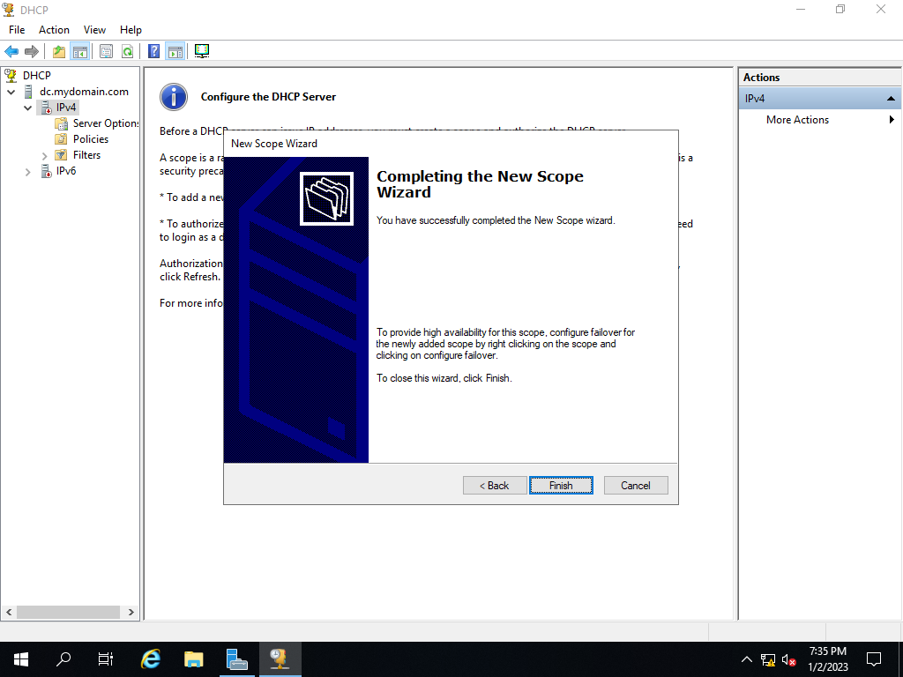
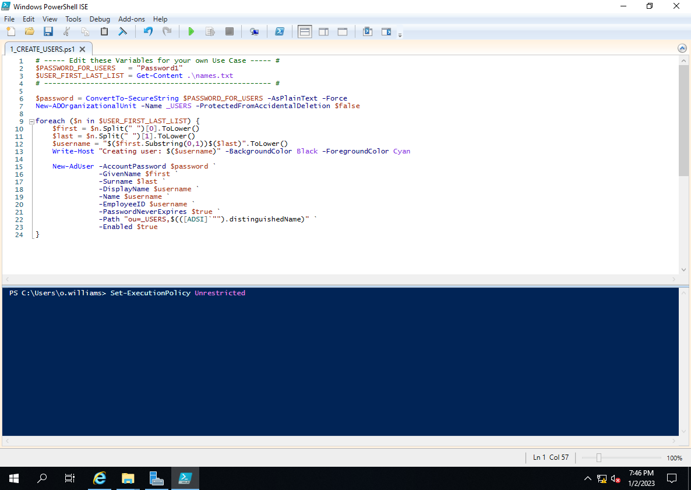

# ActiveDirectoryConfiguration

<h1>Description</h1>
  
<h2>Configuring Active Directory From Scratch using PowerShell Script to Automate Adding 1000 users</h2>
 
  <h2>1. Creating Admin account and password </h2>
 
 
 
 <h2>2. Setting up Active Directory Domain Services </h2>
 
 
 
 <h2>3. Creating Organization Unit in AD <h2>
 
 
  
  <h2>4. Setting up RAS and NAT <h2>
   
   
    
  <h2> Congfiguring DHCP Server <h2>
    
    
    
    <h2> Enabling PowerShell script <h2>
      
      
 
 
 

