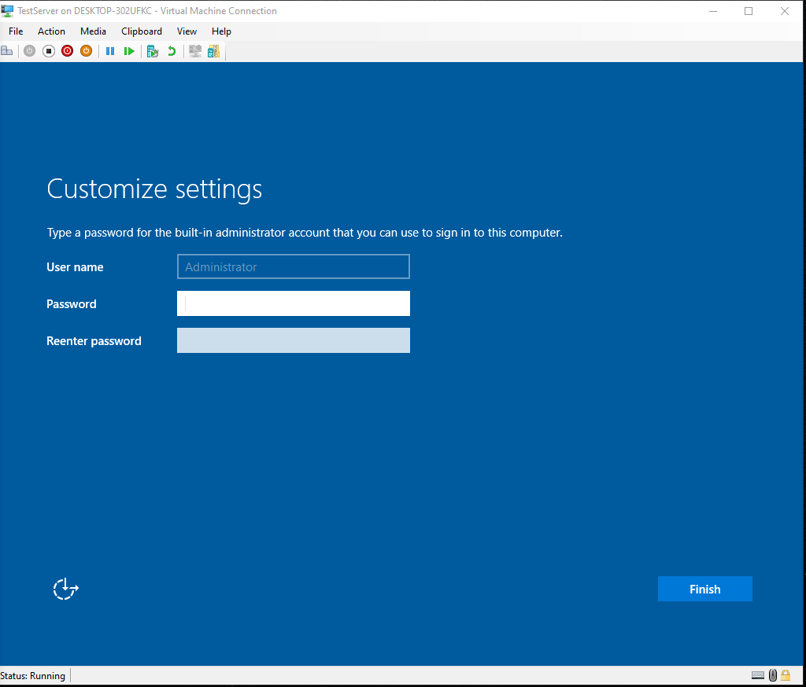
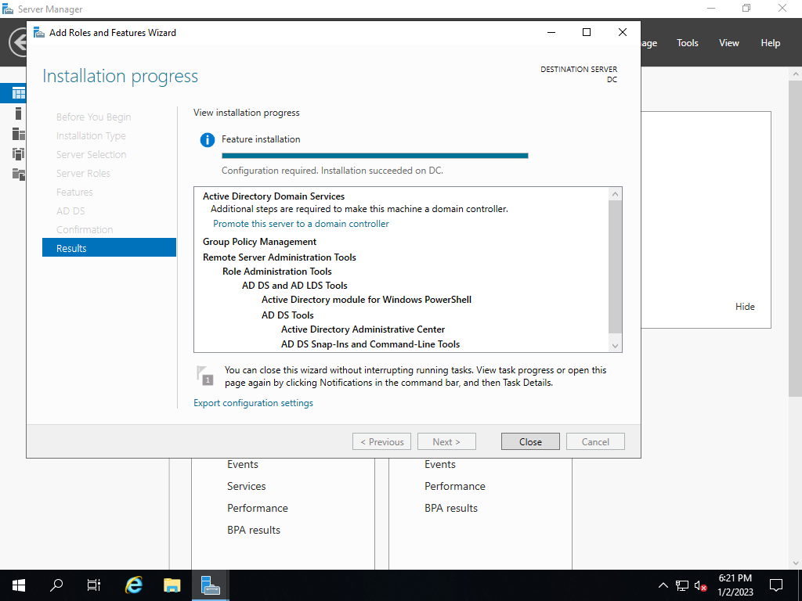

# ActiveDirectoryConfiguration

<h1>Description</h1>
  
<h2>Configuring Active Directory From Scratch using PowerShell Script to Automate Adding 1000 users</h2>
 
  <h2>1. Creating Admin account and password </h2>
 
 
 
 <h2> 2. Setting up Active Directory Domain Services </h2>
 
 
